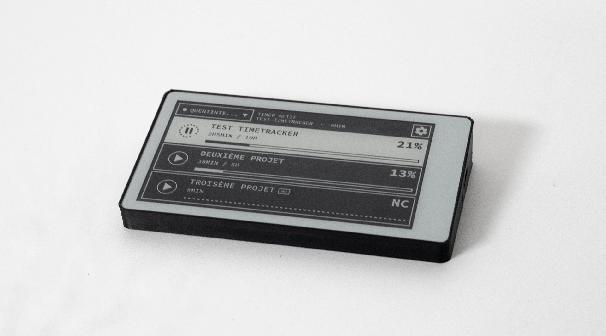

# Timetracker — LilyGo T5 4.7" e-paper



Suivi du temps de l'équipe SuperSerif sur un écran e-paper 960×540 tactile (ESP32-S3), synchronisé avec l'application web Lineup via son API REST.

## Ce que fait l'écran

- Un écran = un membre de l'équipe (pastille en haut à gauche pour changer).
- Affiche ses projets « En cours » avec heures, barre de progression et %.
- Un appui sur une ligne démarre ou arrête le décompte. Un appui sur un autre
  projet arrête le précédent et démarre le nouveau. Un seul projet à la fois.
- Les heures sont accumulées **côté serveur** (sessions start/stop).
- Wi-Fi configuré sur l'écran : liste des réseaux + clavier. Pas de point d'accès.
- En-tête : pastille membre, statut, **Réglages**. Thème clair/sombre dans les réglages. Pas de batterie
  (USB-C) ni d'indicateur de signal Wi-Fi.

## Prise en main

Copier [`.env.example`](.env.example) vers `.env` et renseigner l'origine de
l'API Lineup. `.env` n'est **pas** versionné : il ne partira pas sur GitHub.

```bash
cp .env.example .env    # Windows : copy .env.example .env
# puis éditer API_BASE (et API_TOKEN si besoin)
pio run                 # compiler
pio run -t upload       # flasher
pio device monitor      # journal série
```

Au premier build, `tools/ensure_esptool_deps.py` installe le module Python
`intelhex` si besoin. L'esptool livré avec `tool-esptoolpy` 4.9 en dépend, mais
PlatformIO ne le met pas dans son virtualenv ; sans ça la génération de
`bootloader.bin` échoue sur `ModuleNotFoundError: No module named 'intelhex'`.
L'installer à la main marche aussi, mais PlatformIO recrée son virtualenv à
chaque mise à jour de son core et le module disparaît — d'où la vérification
intégrée au build.

Au premier démarrage (aucun réseau enregistré) :

1. L'écran liste les Wi-Fi visibles.
2. Appuyer sur un réseau. S'il est protégé, un clavier s'affiche.
3. Saisir le mot de passe, **Connecter**.

L'écran vérifie qu'il y a un accès Internet avant d'enregistrer le réseau
(jusqu'à 5). Ensuite il demande à quel membre attribuer cet écran
(`GET /api/people`).

Les temporisations et le reste de la config firmware sont dans
[`src/Config.h`](src/Config.h). L'URL et le jeton API viennent de `.env`
(injectés au build par [`tools/load_dotenv.py`](tools/load_dotenv.py)).
La console de test Lineup est sur `/api-test` de cette même origine.

## Décompte du temps

L'écran envoie `POST /api/sessions` (`start` / `stop`) pour la personne attribuée.
Le serveur accumule les heures. L'écran relit `hours.done` via
`GET /api/sessions/current` (cette valeur **inclut** déjà le temps de la
session en cours) et la liste `GET /api/projects?status=demarre&person_id=…`.

Les membres viennent de `GET /api/people` : on peut attribuer l'écran à
quelqu'un même s'il n'a pas de projet actif.

Hors ligne, start/stop sont mis en file d'attente (NVS) et rejoués au retour
du réseau. Un 409 (`stop` sans session, projet plus « en cours ») abandonne
l'action. Le nombre d'actions en attente s'affiche en bas à droite et dans
les réglages.

**Précision.** L'API stocke `hours.done` à 2 décimales (0,01 h = 36 s). L'écran
affiche les heures à 1 décimale (6 min) et le temps de session en minutes
entières. La ligne du projet en cours est redessinée toutes les 10 minutes
(même cadence que la relecture de session). La liste des projets est
resynchronisée toutes les 5 minutes.

## Écrans

| Écran | Accès |
| --- | --- |
| Liste des projets | écran principal |
| Utilisateur de cet écran | pastille en haut à gauche |
| Réglages | bouton « Réglages » |
| Wi-Fi + clavier | premier boot, ou Réglages → « Choisir un Wi-Fi » |

Le bouton **Nettoyer l'écran** lance un cycle de rafraîchissement appuyé.

## Notes techniques

**Rafraîchissement.** Le firmware compose l'interface en PSRAM, la compare à
ce qui est sur la dalle, et ne pousse que les bandes horizontales **pleine
largeur** qui ont changé (une ligne de projet, l'en-tête ou le pied). Un
recadrage en X coupait les glyphes et superposait les chiffres. Un cycle
complet est forcé toutes les 24 mises à jour partielles, ou toutes les heures.
Sur le clavier Wi-Fi ce cycle est reporté à l'écran suivant, pour ne pas
faire clignoter la dalle pendant la saisie du mot de passe.

**Polices.** Les polices fournies par la librairie LilyGo qui couvrent les
accents (`FiraSans`, `Roboto`) font 50 et 59 px de hauteur de ligne, trop pour
une interface dense. [`tools/genfonts.py`](tools/genfonts.py) génère
`src/ui_fonts.h` : sept graisses/tailles de Barlow Semi Condensed, en ASCII +
supplément Latin-1. Le fichier généré est versionné, le script n'est nécessaire
que pour le régénérer.

Le rendu de texte ne connaît pas les caractères hors Latin-1 : pas
d'apostrophes typographiques (`’`), de points de suspension (`…`) ni de tirets
cadratins (`—`) dans les chaînes de l'interface.

**Vérification de la mise en page.** Les coordonnées sont posées à la main.
[`tools/checklayout.py`](tools/checklayout.py) lit les largeurs de glyphes dans
le header généré, récupère les projets réels depuis l'API, et vérifie que
chaque libellé tient dans la zone qui lui est réservée.

```bash
python tools/checklayout.py
```

**Sécurité.** L'API est ouverte pour l'instant. Quand elle sera verrouillée, il
suffira de renseigner `API_TOKEN` dans `.env` : le client envoie déjà
l'en-tête `Authorization: Bearer` quand ce champ est non vide. Le certificat
TLS n'est pas épinglé (Vercel le renouvelle régulièrement). N'ajoutez jamais
`.env` au dépôt — seul [`.env.example`](.env.example) (sans secrets) va sur GitHub.

## Organisation

```
.env.example          modèle des identifiants API (à copier vers .env)
assets/               PNG sources des icônes, logo, packshot
enclosure/            fichiers 3D du boîtier (3MF, STEP, STL)
src/
  main.cpp            orchestration : écrans, actions tactiles, cadences
  Config.h            temporisations ; API_BASE / API_HOST / API_TOKEN via .env
  Model.h             Project, Person, SessionSnapshot, NetInfo
  Store.*             persistance NVS (réseaux, utilisateur attribué, session, file)
  ApiClient.*         people, projects, sessions
  WifiPortal.*        STA multi-réseaux, scan, join, vérif Internet, NTP
  Tracker.*           start/stop, lecture de session, file d'attente hors ligne
  Ui.*                rendu, diff par bande pleine largeur, clavier
  TouchInput.*        dalle GT911 (front montant uniquement)
  ui_fonts.h          généré
  ui_icons.h          généré depuis assets/
tools/
  load_dotenv.py      injecte .env dans les flags de compilation
  envutil.py          lecture partagée de .env
  genfonts.py         génération des polices
  genicons.py         génération des icônes
  checklayout.py      vérification des largeurs de texte
lib/
  LilyGo-EPD47-esp32s3/   driver e-paper (vendorisé, réduit au driver + zlib)
```

La librairie LilyGo est placée dans `lib/`, où PlatformIO la compile
automatiquement avec le zlib qu'elle embarque — nécessaire puisque les glyphes
sont stockés compressés. Exemples, docs, JPEG, tactile LilyGo et polices
Roboto/FiraSans d'origine ont été retirés : le firmware a son propre rendu,
TouchInput (SensorLib/GT911) et `ui_fonts.h`.

## Matériel

LilyGo T5 4.7" e-paper **v2.3 (ESP32-S3, version tactile)**, 16 Mo de flash,
8 Mo de PSRAM OPI. La PSRAM est indispensable : les deux framebuffers
occupent 2 × 253 Ko.

Le boîtier à imprimer est dans [`enclosure/`](enclosure/) :
[`lilygo-timetracker.stl`](enclosure/lilygo-timetracker.stl) pour l'impression,
[`lilygo-timetracker.3mf`](enclosure/lilygo-timetracker.3mf) et
[`lilygo-timetracker.step`](enclosure/lilygo-timetracker.step) pour modifier le
modèle.

Si l'écran ne réagit pas au toucher, le journal série indique
`GT911 not found on I2C` et l'écran affiche un avertissement : vérifier la
nappe de la dalle.
